# Wireshark Network Traffic Analysis

## Project Overview

This project demonstrates practical network traffic analysis using Wireshark. A live packet capture was collected from a Windows host and examined to understand how common network protocols behave during normal communication.

The analysis focused on protocol identification, packet filtering, request-and-response correlation, TCP session establishment, DNS resolution, encrypted TLS traffic, endpoint activity, network conversations, and traffic patterns over time.

The goal was not to label normal traffic as malicious, but to build a structured investigation process based on observable packet evidence.

## Objectives

- Capture live network traffic using Wireshark.
- Apply display filters to isolate specific protocols.
- Analyze ARP request and reply behaviour.
- Examine ICMP Echo Request and Echo Reply traffic.
- Investigate DNS queries and responses.
- Identify a TCP three-way handshake.
- Inspect TLS handshake metadata and encrypted application data.
- Use Protocol Hierarchy, Endpoints, Conversations, Follow TCP Stream, and I/O Graphs for higher-level traffic analysis.
- Distinguish observable indicators from conclusions that require further investigation.

## Tools Used

- Wireshark 4.6.9
- Windows Command Prompt
- `ping`
- `nslookup`
- `curl`

## Protocols Observed

The capture included traffic associated with:

- ARP
- IPv4 and IPv6
- ICMP / ICMPv6
- DNS
- TCP
- UDP
- TLS
- HTTP-related traffic
- QUIC

## Investigation Summary

### 1. Live Packet Capture

A live capture was performed on the active network interface. Wireshark displayed source and destination addresses, protocols, packet lengths, and packet-level information in real time.

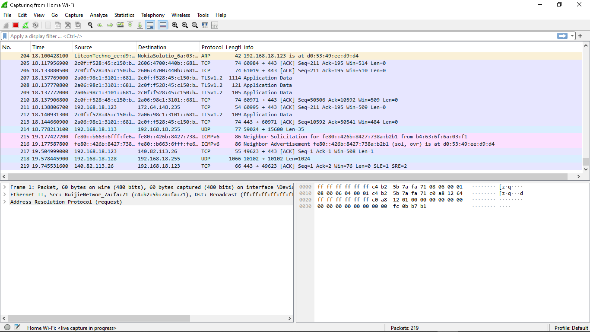

### 2. ARP Request Analysis

An ARP request was inspected to determine how a device resolves an IPv4 address to a MAC address on the local network. The request showed the sender IP and MAC address, the target IPv4 address, and an unknown target MAC address.

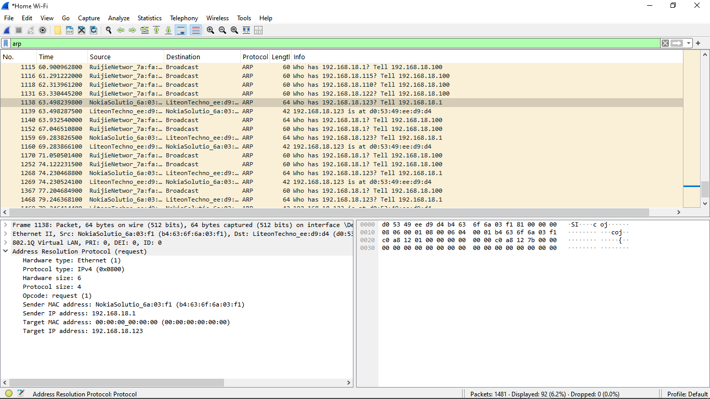

### 3. ARP Reply Analysis

The corresponding ARP reply was identified. The reply supplied the MAC address associated with the requested IPv4 address, completing the ARP resolution process.

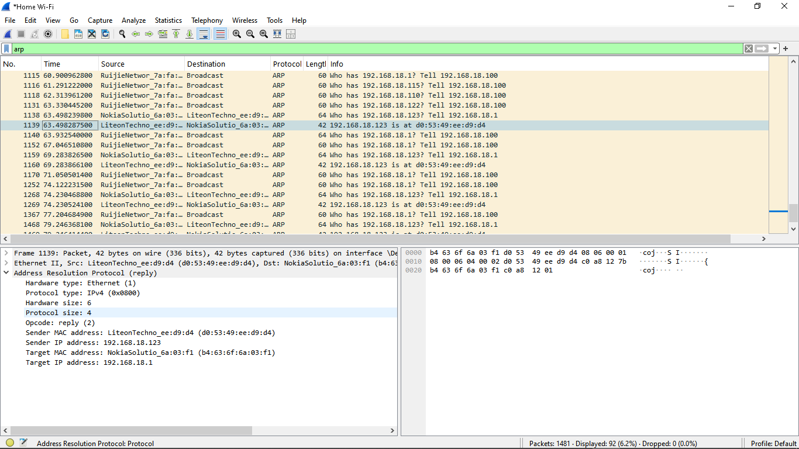

### 4. ICMP Echo Request

ICMP traffic was deliberately generated using `ping 8.8.8.8`. The Echo Request packet was inspected and correlated with its response frame. The request used ICMP Type 8.

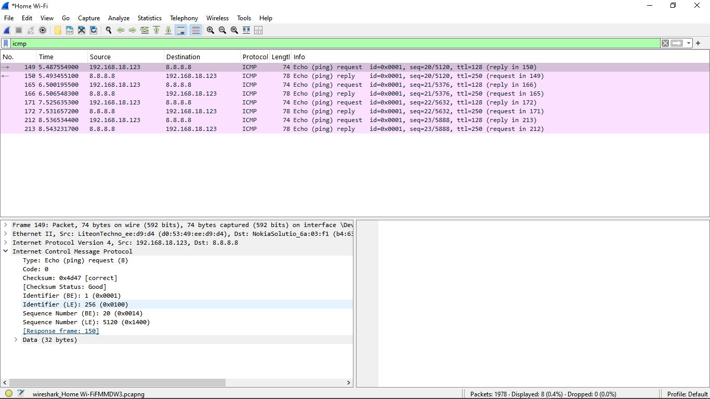

### 5. ICMP Echo Reply

The corresponding Echo Reply was inspected. Wireshark showed ICMP Type 0, the matching sequence number, the request frame, and the measured response time.

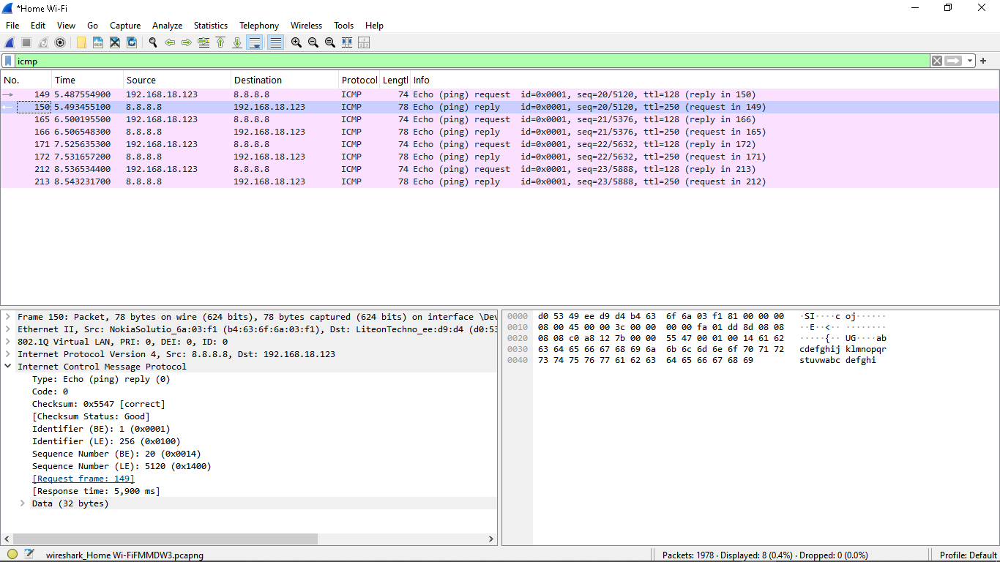

### 6. DNS Query Analysis

A DNS lookup was generated using `nslookup`. The DNS query requested an A record for `www.google.com`, demonstrating how a client requests IPv4 address information from a DNS server.

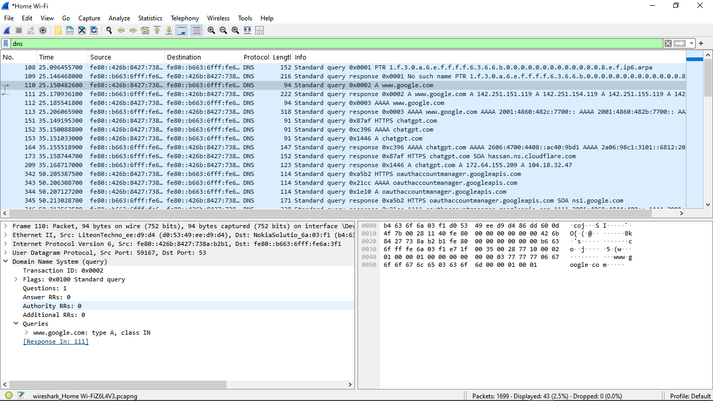

### 7. DNS Response Analysis

The DNS response was matched using the transaction ID. The response contained multiple IPv4 address records and showed that the query completed without an error.

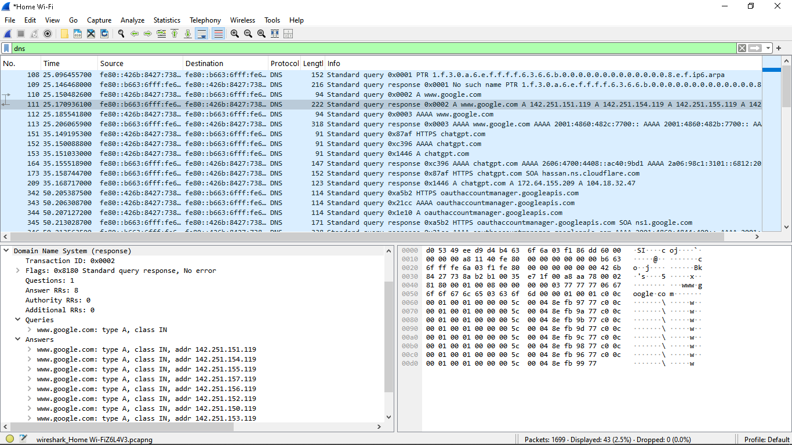

### 8. TCP Three-Way Handshake

A TCP stream was isolated and the connection-establishment sequence was identified:

1. `SYN` — the client requested a TCP connection.
2. `SYN, ACK` — the server acknowledged and accepted the request.
3. `ACK` — the client confirmed the connection.

The observed connection used destination port 443, indicating an HTTPS/TLS service.

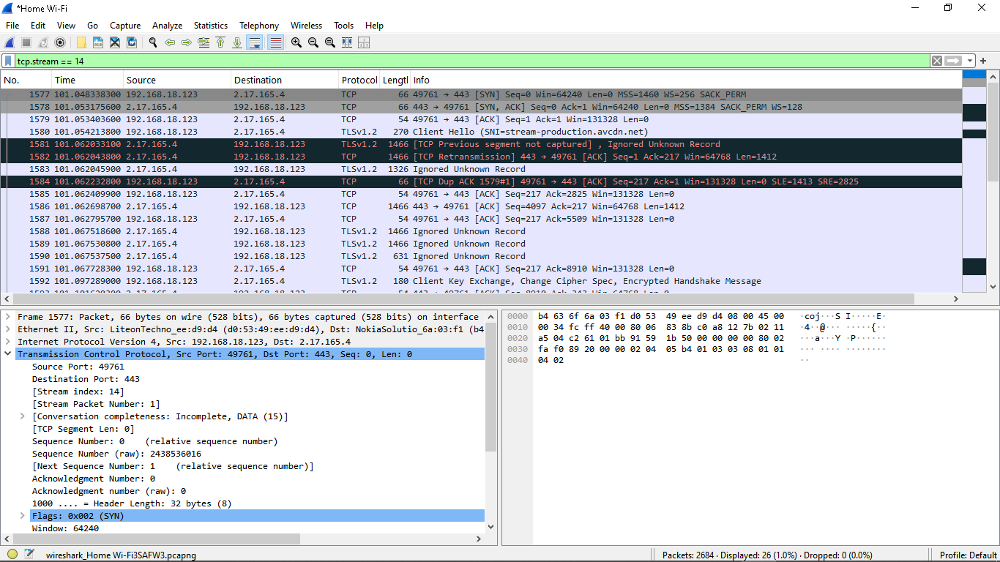

### 9. TLS Client Hello

A TLS Client Hello was inspected. Observable handshake metadata included the TLS version, supported cipher suites, extensions, and Server Name Indication (SNI).

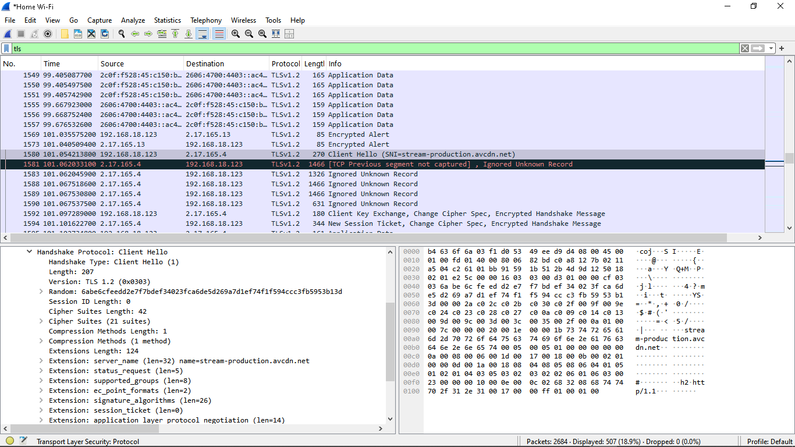

### 10. Encrypted TLS Application Data

TLS application traffic was inspected after the handshake. Wireshark could identify the TLS record type and metadata, but the application payload appeared as encrypted data rather than readable plaintext.

This demonstrates an important security-analysis principle: encryption protects application content while some network metadata may remain observable.

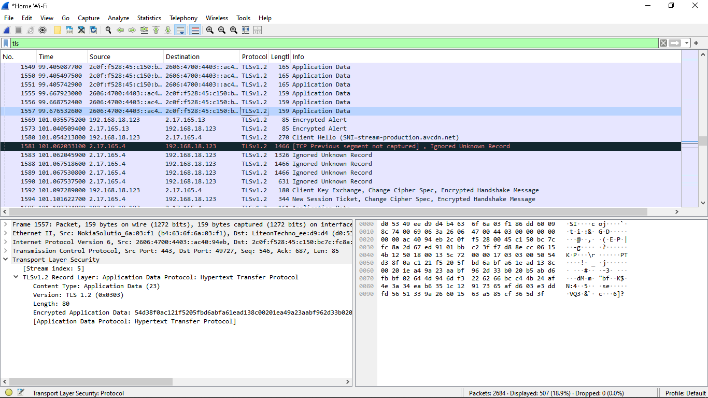

### 11. Protocol Hierarchy Analysis

Wireshark's Protocol Hierarchy was used to obtain a high-level view of the entire capture. The capture contained 2,684 packets and included significant IPv6, TCP, TLS, QUIC, DNS, ICMPv6, IPv4, and ARP activity.

This view was used to understand protocol distribution without assuming that protocol presence alone indicates malicious behaviour.

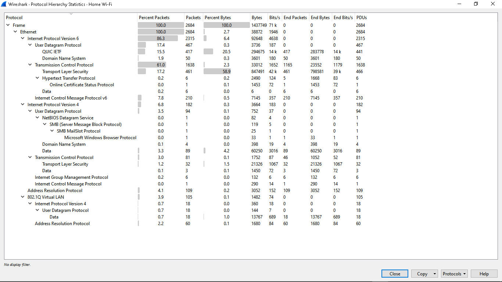

### 12. IPv4 Endpoint Analysis

The Endpoints view was used to identify IPv4 hosts present in the capture and compare packet and byte counts in each direction.

This provided a quick way to identify active systems for further investigation.

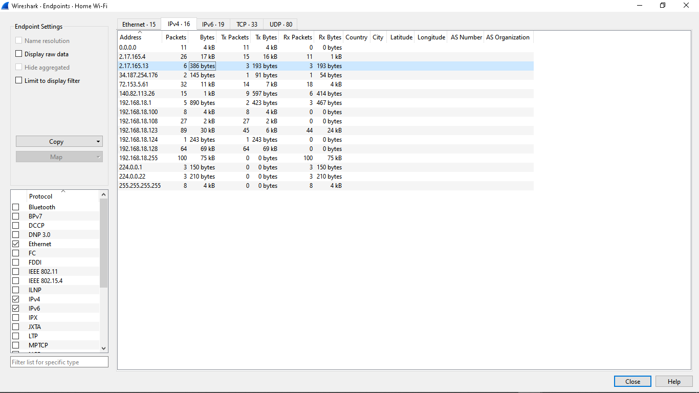

### 13. TCP Conversation Analysis

The Conversations view was used to determine which systems communicated directly with each other, which ports were involved, and how many packets and bytes were exchanged.

One investigated HTTPS conversation used TCP stream 14 and destination port 443.

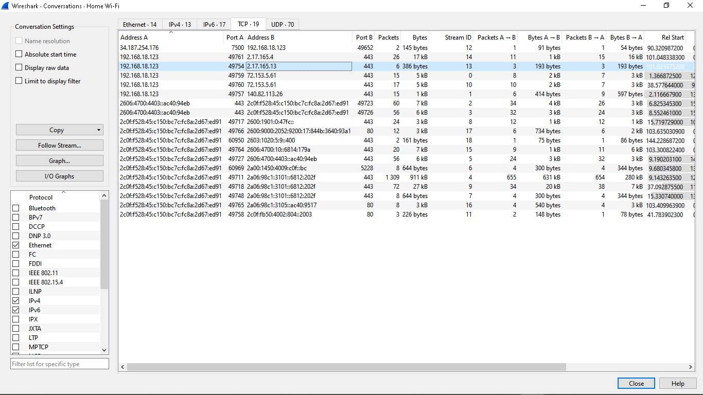

### 14. Follow TCP Stream

TCP stream 14 was followed to examine the complete conversation. TLS-related metadata was visible, while much of the application content remained unreadable because it was encrypted.

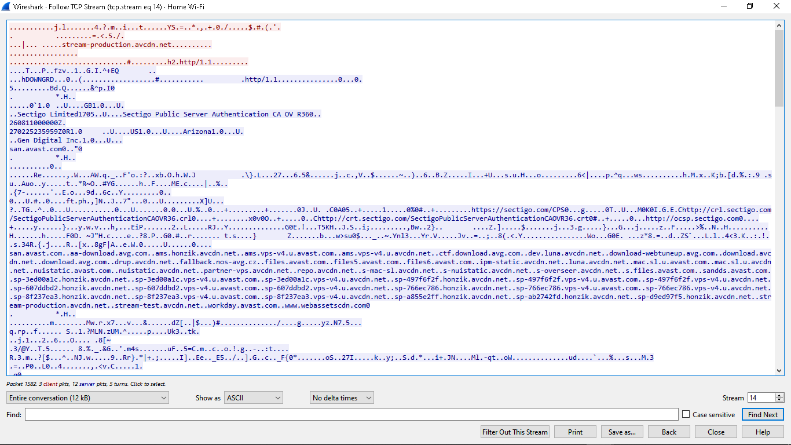

### 15. I/O Graph Analysis

Wireshark's I/O Graph was used to visualize packet activity over time and identify bursts of network traffic. TCP analysis flags were treated as indicators requiring investigation rather than automatic proof of a security incident.

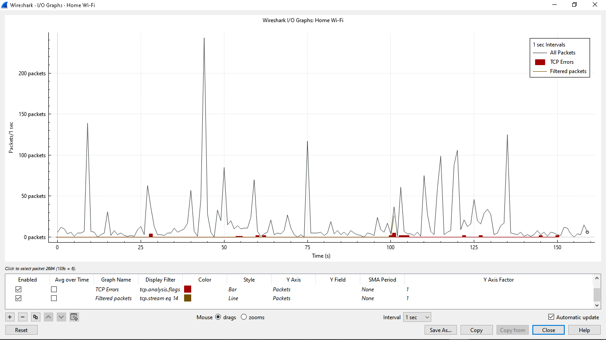

## Key Findings

- ARP successfully mapped local IPv4 addresses to MAC addresses.
- ICMP request/reply pairs demonstrated successful network reachability.
- DNS queries and responses showed how hostnames are resolved to IP addresses.
- TCP connection establishment followed the SYN → SYN/ACK → ACK sequence.
- TLS traffic exposed useful connection metadata while protecting application payloads through encryption.
- Endpoint and conversation statistics helped identify active hosts and high-volume communications.
- Protocol and TCP analysis indicators must be investigated in context before determining whether activity is abnormal or malicious.

## Skills Demonstrated

- Packet capture and filtering
- Wireshark display filters
- ARP analysis
- ICMP analysis
- DNS analysis
- TCP/IP analysis
- TCP three-way handshake identification
- TLS/HTTPS traffic analysis
- Endpoint and conversation analysis
- Protocol hierarchy analysis
- TCP stream analysis
- I/O graph interpretation
- Evidence-based network troubleshooting
- Basic network security analysis

## Packet Capture File

The packet capture used for this analysis is included in this repository as `Wireshark Network Traffic Analysis.pcapng`. The capture can be opened in Wireshark to review the packets, apply the documented display filters, and reproduce the analysis presented in this project.

## Project Outcome

This project demonstrates practical experience capturing, filtering, interpreting, and documenting network traffic using Wireshark. It combines packet-level protocol analysis with higher-level traffic statistics and reinforces an evidence-based approach to network and cybersecurity investigations.
